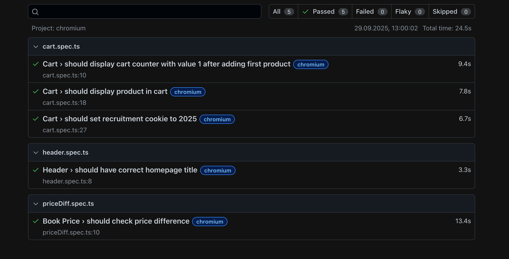

# Empik E2E (Playwright + TypeScript)

Zbiór testów E2E dla **empik.com** napisanych w **Playwright + TypeScript**.

## Szybki start

```bash
npm ci
npm run setup     # npx playwright install --with-deps
npm test          # uruchom wszystkie testy
```

## Przypadki testowe

1. **Tytuł strony głównej** – weryfikacja `<title>`.
2. **Książki → Nowości** – przejście i policzenie różnicy między najtańszą a najdroższą książką.
3. **Koszyk** – dodanie produktu, sprawdzenie licznika w headerze, ustawienie ciastka `rekrutacja=2025`, weryfikacja pozycji w koszyku.

## Struktura projektu

```
src/pages/         # Page Objects (HomePage, ProductsListPage, Header, Cart)
src/fixtures/      # niestandardowe fixture'y Playwrighta
tests/             # specy testowe
playwright.config.ts
```

## Uruchomienie lokalne

```bash
git clone https://github.com/matkub0/empik-e2e-recruitment.git
cd empik-e2e-recruitment
npm ci && npm run setup && npm test
```

## Przykładowy raport

Przykładowy wygląd raportu HTML programu Playwright po przeprowadzeniu testów:


